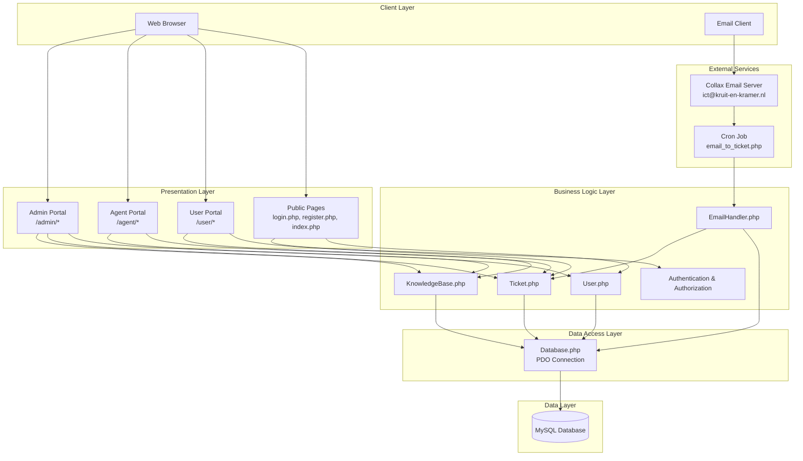

# Design Document - ICT Ticketportaal

## Overview

The ICT Ticketportaal is a PHP-based web application that provides comprehensive ticket management for ICT support operations. The system follows a traditional MVC-inspired architecture with a clear separation between data access (classes), business logic, presentation (views), and configuration. The application will be built using PHP 7.4+ with PDO for database operations, MySQL 5.7+ for data persistence, and Bootstrap 5 for responsive UI.

### Key Design Principles

1. **Security First**: All user inputs sanitized, passwords hashed with bcrypt, CSRF protection on forms, and prepared statements for all database queries
2. **Role-Based Access Control**: Three distinct user roles (user, agent, admin) with appropriate permission boundaries
3. **Modular Architecture**: Reusable PHP classes for core functionality, shared includes for UI components
4. **Responsive Design**: Mobile-first approach using Bootstrap 5 for cross-device compatibility
5. **Email Integration**: Dual-channel ticket creation (web + email) with automated parsing and notifications

## Architecture

### High-Level Architecture



### Directory Structure

```
/ticketportaal/
├── /assets/                    # Static assets
│   ├── /css/
│   │   ├── style.css          # Main stylesheet
│   │   └── admin.css          # Admin-specific styles
│   ├── /js/
│   │   ├── main.js            # Core JavaScript functionality
│   │   └── admin.js           # Admin panel interactions
│   └── /images/
│       └── logo.png
│
├── /config/                    # Configuration files
│   ├── database.php           # Database connection settings
│   ├── config.php             # Application configuration
│   └── email.php              # Email server settings
│
├── /includes/                  # Reusable UI components
│   ├── header.php             # Common header
│   ├── footer.php             # Common footer
│   ├── sidebar.php            # Navigation sidebar
│   └── functions.php          # Helper functions
│
├── /classes/                   # Core business logic classes
│   ├── Database.php           # PDO database wrapper
│   ├── User.php               # User management
│   ├── Ticket.php             # Ticket operations
│   ├── EmailHandler.php       # Email processing
│   └── KnowledgeBase.php      # KB operations
│
├── /admin/                     # Admin portal
│   ├── index.php              # Admin dashboard
│   ├── tickets.php            # All tickets management
│   ├── users.php              # User management
│   ├── categories.php         # Category management
│   ├── knowledge_base.php     # KB management
│   └── reports.php            # Analytics & reports
│
├── /agent/                     # Agent portal
│   ├── dashboard.php          # Agent dashboard
│   ├── my_tickets.php         # Assigned tickets
│   └── knowledge_base.php     # KB access
│
├── /user/                      # User portal
│   ├── dashboard.php          # User dashboard
│   ├── create_ticket.php      # Ticket creation form
│   ├── my_tickets.php         # User's tickets
│   └── knowledge_base.php     # Public KB
│
├── /api/                       # API endpoints
│   ├── tickets.php            # Ticket AJAX operations
│   └── email_handler.php      # Email webhook
│
├── /uploads/                   # File uploads (not in version control)
│   └── /tickets/
│
├── index.php                   # Landing page
├── login.php                   # Login page
├── register.php                # Registration page
├── logout.php                  # Logout handler
├── knowledge_base.php          # Public KB
└── email_to_ticket.php         # Email processing cron script
```

## Components and Interfaces

### 1. Database Layer

#### Database.php Class

**Purpose**: Singleton PDO wrapper for database connections and query execution

**Key Methods**:
- `getInstance()`: Returns singleton database instance
- `getConnection()`: Returns PDO connection object
- `query($sql, $params)`: Execute prepared statement with parameters
- `fetchAll($sql, $params)`: Fetch multiple rows
- `fetchOne($sql, $params)`: Fetch single row
- `execute($sql, $params)`: Execute INSERT/UPDATE/DELETE
- `lastInsertId()`: Get last inserted ID

**Design Rationale**: Singleton pattern ensures single database connection throughout request lifecycle, reducing overhead. All queries use prepared statements to prevent SQL injection.

### 2. User Management

#### User.php Class

**Purpose**: Handle all user-related operations including authentication, registration, and profile management

**Key Methods**:
- `register($email, $password, $firstName, $lastName, $department)`: Create new user account
- `login($email, $password)`: Authenticate user and create session
- `logout()`: Destroy user session
- `getUserById($userId)`: Retrieve user details
- `updateUser($userId, $data)`: Update user information
- `changePassword($userId, $newPassword)`: Update user password
- `requestPasswordReset($email)`: Generate password reset token
- `resetPassword($token, $newPassword)`: Reset password using token
- `getUsersByRole($role)`: Get all users with specific role
- `deactivateUser($userId)`: Set user as inactive
- `checkPermission($userId, $permission)`: Verify user has permission

**Session Management**:
- Store user_id, role, email, and full_name in $_SESSION
- Implement 30-minute inactivity timeout
- Regenerate session ID on login to prevent fixation attacks

**Password Security**:
- Use `password_hash()` with PASSWORD_BCRYPT
- Minimum 8 characters, require mix of letters and numbers
- Store reset tokens with expiration (1 hour)

### 3. Ticket Management

#### Ticket.php Class

**Purpose**: Core ticket operations including creation, updates, assignment, and status management

**Key Methods**:
- `createTicket($userId, $title, $description, $categoryId, $priority, $source)`: Create new ticket
- `generateTicketNumber()`: Generate unique KK-YYYY-XXXX format number
- `getTicketById($ticketId)`: Retrieve ticket details with related data
- `getTicketsByUser($userId)`: Get all tickets for a user
- `getAllTickets($filters)`: Get tickets with filtering (status, priority, category, date range)
- `assignTicket($ticketId, $agentId)`: Assign ticket to agent
- `updateStatus($ticketId, $status, $resolution)`: Update ticket status
- `addComment($ticketId, $userId, $comment, $isInternal)`: Add comment to ticket
- `getComments($ticketId, $includeInternal)`: Retrieve ticket comments
- `addAttachment($ticketId, $filename, $filepath)`: Store file attachment
- `getAttachments($ticketId)`: Retrieve ticket attachments
- `setRating($ticketId, $rating)`: Store satisfaction rating
- `checkSLA($ticketId)`: Calculate if ticket is within SLA
- `getOverdueTickets()`: Get tickets exceeding SLA

**Ticket Number Generation**:
- Format: KK-YYYY-XXXX (e.g., KK-2025-0001)
- YYYY = current year
- XXXX = sequential number, reset annually
- Check for uniqueness before assignment

### 4. Email Processing

#### EmailHandler.php Class

**Purpose**: Parse incoming emails and convert them to tickets, send notification emails

**Key Methods**:
- `parseEmail($emailContent)`: Extract subject, body, sender, attachments from email
- `createTicketFromEmail($emailData)`: Convert parsed email to ticket
- `findOrCreateUser($email)`: Match email to existing user or create basic account
- `sendTicketConfirmation($ticketId, $recipientEmail)`: Send ticket creation confirmation
- `sendStatusUpdate($ticketId, $recipientEmail)`: Notify of status change
- `sendAssignmentNotification($ticketId, $agentEmail, $userEmail)`: Notify of assignment
- `sendCommentNotification($ticketId, $recipientEmail)`: Notify of new comment
- `sendResolutionNotification($ticketId, $recipientEmail)`: Notify of resolution
- `sendAutoReply($recipientEmail, $ticketNumber)`: Send auto-reply with ticket number

**Email Parsing Strategy**:
- Use PHP IMAP functions to connect to mailbox
- Parse MIME structure for multipart messages
- Extract plain text body (prefer over HTML)
- Download and store attachments securely
- Strip email signatures and quoted replies

**Cron Job Implementation**:
- `email_to_ticket.php` runs every 5 minutes via cron
- Connects to ict@kruit-en-kramer.nl mailbox
- Processes unread emails
- Marks processed emails as read
- Logs processing errors for review

### 5. Knowledge Base

#### KnowledgeBase.php Class

**Purpose**: Manage knowledge base articles including CRUD operations and search

**Key Methods**:
- `createArticle($title, $content, $categoryId, $tags, $authorId)`: Create new KB article
- `updateArticle($kbId, $data)`: Update existing article
- `deleteArticle($kbId)`: Soft delete article
- `getArticleById($kbId)`: Retrieve single article
- `getAllArticles($includeUnpublished)`: Get all articles
- `getPublishedArticles()`: Get only published articles
- `searchArticles($searchTerm, $includeUnpublished)`: Full-text search
- `getArticlesByCategory($categoryId)`: Filter by category
- `incrementViews($kbId)`: Increment view counter
- `publishArticle($kbId)`: Set article as published
- `unpublishArticle($kbId)`: Set article as unpublished

**Search Implementation**:
- Use MySQL FULLTEXT index on title and content columns
- Search also includes tags (comma-separated)
- Return results ordered by relevance score

### 6. Category Management

**Purpose**: Manage ticket categories with SLA settings

**Key Operations**:
- CRUD operations for categories
- Each category has: name, description, default_priority, sla_hours
- Active/inactive status to hide categories without breaking existing tickets
- Used for both tickets and knowledge base articles

## Data Models

### Database Schema

#### users Table
```sql
CREATE TABLE users (
    user_id INT PRIMARY KEY AUTO_INCREMENT,
    email VARCHAR(255) UNIQUE NOT NULL,
    password VARCHAR(255) NOT NULL,
    first_name VARCHAR(100) NOT NULL,
    last_name VARCHAR(100) NOT NULL,
    department VARCHAR(100),
    role ENUM('user', 'agent', 'admin') DEFAULT 'user',
    created_at TIMESTAMP DEFAULT CURRENT_TIMESTAMP,
    last_login TIMESTAMP NULL,
    is_active BOOLEAN DEFAULT TRUE,
    INDEX idx_email (email),
    INDEX idx_role (role)
);
```

#### tickets Table
```sql
CREATE TABLE tickets (
    ticket_id INT PRIMARY KEY AUTO_INCREMENT,
    ticket_number VARCHAR(20) UNIQUE NOT NULL,
    user_id INT,
    assigned_agent_id INT NULL,
    category_id INT,
    title VARCHAR(255) NOT NULL,
    description TEXT NOT NULL,
    priority ENUM('low', 'medium', 'high', 'urgent') DEFAULT 'medium',
    status ENUM('open', 'in_progress', 'pending', 'resolved', 'closed') DEFAULT 'open',
    source ENUM('web', 'email', 'phone') DEFAULT 'web',
    created_at TIMESTAMP DEFAULT CURRENT_TIMESTAMP,
    updated_at TIMESTAMP DEFAULT CURRENT_TIMESTAMP ON UPDATE CURRENT_TIMESTAMP,
    resolved_at TIMESTAMP NULL,
    resolution TEXT NULL,
    satisfaction_rating INT NULL,
    FOREIGN KEY (user_id) REFERENCES users(user_id),
    FOREIGN KEY (assigned_agent_id) REFERENCES users(user_id),
    FOREIGN KEY (category_id) REFERENCES categories(category_id),
    INDEX idx_ticket_number (ticket_number),
    INDEX idx_user_id (user_id),
    INDEX idx_assigned_agent (assigned_agent_id),
    INDEX idx_status (status),
    INDEX idx_created_at (created_at)
);
```

#### categories Table
```sql
CREATE TABLE categories (
    category_id INT PRIMARY KEY AUTO_INCREMENT,
    name VARCHAR(100) NOT NULL,
    description TEXT,
    default_priority ENUM('low', 'medium', 'high', 'urgent') DEFAULT 'medium',
    sla_hours INT DEFAULT 24,
    is_active BOOLEAN DEFAULT TRUE,
    INDEX idx_is_active (is_active)
);
```

#### ticket_comments Table
```sql
CREATE TABLE ticket_comments (
    comment_id INT PRIMARY KEY AUTO_INCREMENT,
    ticket_id INT NOT NULL,
    user_id INT NOT NULL,
    comment TEXT NOT NULL,
    is_internal BOOLEAN DEFAULT FALSE,
    created_at TIMESTAMP DEFAULT CURRENT_TIMESTAMP,
    FOREIGN KEY (ticket_id) REFERENCES tickets(ticket_id) ON DELETE CASCADE,
    FOREIGN KEY (user_id) REFERENCES users(user_id),
    INDEX idx_ticket_id (ticket_id)
);
```

#### ticket_attachments Table
```sql
CREATE TABLE ticket_attachments (
    attachment_id INT PRIMARY KEY AUTO_INCREMENT,
    ticket_id INT NOT NULL,
    filename VARCHAR(255) NOT NULL,
    filepath VARCHAR(500) NOT NULL,
    filesize INT NOT NULL,
    uploaded_at TIMESTAMP DEFAULT CURRENT_TIMESTAMP,
    FOREIGN KEY (ticket_id) REFERENCES tickets(ticket_id) ON DELETE CASCADE,
    INDEX idx_ticket_id (ticket_id)
);
```

#### knowledge_base Table
```sql
CREATE TABLE knowledge_base (
    kb_id INT PRIMARY KEY AUTO_INCREMENT,
    category_id INT,
    title VARCHAR(255) NOT NULL,
    content TEXT NOT NULL,
    tags TEXT,
    author_id INT,
    views INT DEFAULT 0,
    is_published BOOLEAN DEFAULT FALSE,
    created_at TIMESTAMP DEFAULT CURRENT_TIMESTAMP,
    updated_at TIMESTAMP DEFAULT CURRENT_TIMESTAMP ON UPDATE CURRENT_TIMESTAMP,
    FOREIGN KEY (category_id) REFERENCES categories(category_id),
    FOREIGN KEY (author_id) REFERENCES users(user_id),
    FULLTEXT INDEX idx_search (title, content),
    INDEX idx_published (is_published)
);
```

#### password_resets Table
```sql
CREATE TABLE password_resets (
    reset_id INT PRIMARY KEY AUTO_INCREMENT,
    user_id INT NOT NULL,
    token VARCHAR(64) UNIQUE NOT NULL,
    expires_at TIMESTAMP NOT NULL,
    created_at TIMESTAMP DEFAULT CURRENT_TIMESTAMP,
    FOREIGN KEY (user_id) REFERENCES users(user_id),
    INDEX idx_token (token)
);
```

#### sessions Table (optional, for database session storage)
```sql
CREATE TABLE sessions (
    session_id VARCHAR(128) PRIMARY KEY,
    user_id INT,
    session_data TEXT,
    last_activity TIMESTAMP DEFAULT CURRENT_TIMESTAMP ON UPDATE CURRENT_TIMESTAMP,
    FOREIGN KEY (user_id) REFERENCES users(user_id),
    INDEX idx_last_activity (last_activity)
);
```

## Error Handling

### Error Handling Strategy

1. **Database Errors**:
   - Wrap all database operations in try-catch blocks
   - Log errors to error_log file with timestamp and context
   - Display user-friendly messages (never expose SQL errors to users)
   - Return false or null on failure with error stored in class property

2. **Validation Errors**:
   - Validate all inputs before processing
   - Return array of validation errors with field names
   - Display errors next to relevant form fields
   - Preserve form data on validation failure

3. **Authentication Errors**:
   - Generic "Invalid credentials" message (don't reveal if email exists)
   - Log failed login attempts with IP address
   - Implement rate limiting (5 attempts per 15 minutes)
   - Lock account temporarily after threshold

4. **File Upload Errors**:
   - Validate file type against whitelist (pdf, doc, docx, jpg, png, txt)
   - Check file size (max 10MB)
   - Scan for malicious content if possible
   - Store files outside web root with random filenames
   - Log upload failures with user context

5. **Email Errors**:
   - Log email sending failures
   - Queue failed emails for retry
   - Don't block user operations if email fails
   - Provide admin interface to view email queue

### Error Logging

```php
// Centralized error logging function
function logError($context, $message, $data = []) {
    $logEntry = [
        'timestamp' => date('Y-m-d H:i:s'),
        'context' => $context,
        'message' => $message,
        'data' => $data,
        'user_id' => $_SESSION['user_id'] ?? null,
        'ip' => $_SERVER['REMOTE_ADDR'] ?? null
    ];
    error_log(json_encode($logEntry) . PHP_EOL, 3, __DIR__ . '/logs/app.log');
}
```

## Security Implementation

### 1. Input Validation and Sanitization

```php
// All user inputs sanitized
$email = filter_var($_POST['email'], FILTER_SANITIZE_EMAIL);
$title = htmlspecialchars(trim($_POST['title']), ENT_QUOTES, 'UTF-8');

// Validation
if (!filter_var($email, FILTER_VALIDATE_EMAIL)) {
    $errors['email'] = 'Invalid email format';
}
```

### 2. SQL Injection Prevention

```php
// Always use prepared statements
$stmt = $db->prepare("SELECT * FROM users WHERE email = ?");
$stmt->execute([$email]);
```

### 3. XSS Prevention

- Escape all output using `htmlspecialchars()`
- Use Content Security Policy headers
- Sanitize rich text content in knowledge base

### 4. CSRF Protection

```php
// Generate token on form load
$_SESSION['csrf_token'] = bin2hex(random_bytes(32));

// Validate on form submission
if (!hash_equals($_SESSION['csrf_token'], $_POST['csrf_token'])) {
    die('CSRF token validation failed');
}
```

### 5. Session Security

```php
// Secure session configuration
ini_set('session.cookie_httponly', 1);
ini_set('session.cookie_secure', 1); // HTTPS only
ini_set('session.use_strict_mode', 1);
session_regenerate_id(true); // On login
```

### 6. Password Security

```php
// Hashing
$hashedPassword = password_hash($password, PASSWORD_BCRYPT, ['cost' => 12]);

// Verification
if (password_verify($inputPassword, $hashedPassword)) {
    // Login successful
}
```

### 7. File Upload Security

```php
// Whitelist allowed extensions
$allowedExtensions = ['pdf', 'doc', 'docx', 'jpg', 'png', 'txt'];
$extension = strtolower(pathinfo($_FILES['file']['name'], PATHINFO_EXTENSION));

if (!in_array($extension, $allowedExtensions)) {
    die('File type not allowed');
}

// Store with random filename
$newFilename = bin2hex(random_bytes(16)) . '.' . $extension;
$uploadPath = __DIR__ . '/uploads/tickets/' . $newFilename;
```

## Testing Strategy

### 1. Unit Testing

**Focus Areas**:
- User class methods (registration, login, password hashing)
- Ticket class methods (creation, status updates, SLA calculation)
- Email parsing logic
- Input validation functions

**Tools**: PHPUnit

### 2. Integration Testing

**Focus Areas**:
- Database operations (CRUD for all entities)
- Email sending and receiving workflow
- File upload and retrieval
- Session management across requests

### 3. Security Testing

**Focus Areas**:
- SQL injection attempts
- XSS payload injection
- CSRF token bypass attempts
- Session hijacking scenarios
- File upload malicious files

### 4. User Acceptance Testing

**Test Scenarios**:
- Complete user journey: register → login → create ticket → add comment → rate resolution
- Agent workflow: login → view tickets → assign → update status → add internal note
- Admin workflow: manage users → manage categories → view reports
- Email workflow: send email → verify ticket created → receive auto-reply
- Knowledge base: search → view article → verify view count

### 5. Performance Testing

**Metrics**:
- Page load time < 2 seconds
- Database query execution time
- Concurrent user handling (target: 100 users)
- Email processing time

## UI/UX Design

### Design Framework

- **Bootstrap 5**: Responsive grid system, components, utilities
- **Mobile-First**: Design for mobile, enhance for desktop
- **Accessibility**: WCAG 2.1 AA compliance, keyboard navigation, screen reader support

### Color Scheme

- Primary: #0066cc (professional blue)
- Success: #28a745 (green for resolved tickets)
- Warning: #ffc107 (yellow for pending/overdue)
- Danger: #dc3545 (red for urgent priority)
- Secondary: #6c757d (gray for neutral elements)

### Key UI Components

1. **Navigation**:
   - Top navbar with logo, user menu, notifications
   - Sidebar for role-specific navigation
   - Breadcrumbs for deep navigation

2. **Dashboard Cards**:
   - Ticket statistics (open, in progress, resolved)
   - Quick actions (create ticket, view KB)
   - Recent activity feed

3. **Ticket List**:
   - Filterable table with sorting
   - Status badges with color coding
   - Priority indicators
   - Quick action buttons

4. **Ticket Detail**:
   - Ticket information panel
   - Comment thread
   - Status timeline
   - Attachment list

5. **Forms**:
   - Clear labels and placeholders
   - Inline validation
   - Error messages near fields
   - Success confirmations

### Responsive Breakpoints

- Mobile: < 768px (single column, hamburger menu)
- Tablet: 768px - 1024px (two columns, collapsible sidebar)
- Desktop: > 1024px (full layout with sidebar)

## Deployment Considerations

### Server Requirements

- PHP 7.4 or higher
- MySQL 5.7 or higher
- Apache/Nginx with mod_rewrite
- SSL certificate for HTTPS
- Cron job support for email processing

### Configuration Files

**config/database.php**:
```php
define('DB_HOST', 'localhost');
define('DB_NAME', 'ticketportaal');
define('DB_USER', 'ticketuser');
define('DB_PASS', 'secure_password');
```

**config/email.php**:
```php
define('SMTP_HOST', 'mail.kruit-en-kramer.nl');
define('SMTP_PORT', 587);
define('SMTP_USER', 'ict@kruit-en-kramer.nl');
define('SMTP_PASS', 'email_password');
define('FROM_EMAIL', 'ict@kruit-en-kramer.nl');
define('FROM_NAME', 'ICT Support');
```

**config/config.php**:
```php
define('SITE_URL', 'https://tickets.kruit-en-kramer.nl');
define('SITE_NAME', 'ICT Ticketportaal');
define('SESSION_TIMEOUT', 1800); // 30 minutes
define('MAX_FILE_SIZE', 10485760); // 10MB
define('UPLOAD_PATH', __DIR__ . '/../uploads/');
```

### Cron Job Setup

```bash
# Run email processor every 5 minutes
*/5 * * * * /usr/bin/php /path/to/ticketportaal/email_to_ticket.php >> /path/to/logs/cron.log 2>&1
```

### Database Initialization

1. Create database and user
2. Run schema creation scripts
3. Insert default categories
4. Create initial admin user
5. Set up indexes

### Security Hardening

1. Move uploads directory outside web root
2. Disable directory listing
3. Set proper file permissions (644 for files, 755 for directories)
4. Configure .htaccess for Apache or nginx config
5. Enable HTTPS redirect
6. Set security headers (X-Frame-Options, X-XSS-Protection, etc.)

## Performance Optimization

### Database Optimization

1. **Indexing**: All foreign keys, frequently queried columns (status, created_at, email)
2. **Query Optimization**: Use EXPLAIN to analyze slow queries
3. **Connection Pooling**: Reuse database connections
4. **Pagination**: Limit results to 25-50 per page

### Caching Strategy

1. **Session Caching**: Store sessions in memory (Redis/Memcached) for production
2. **Query Caching**: Cache frequently accessed data (categories, user roles)
3. **Static Assets**: Set far-future expires headers for CSS/JS/images
4. **Knowledge Base**: Cache popular articles

### Code Optimization

1. **Autoloading**: Use PSR-4 autoloading for classes
2. **Minimize Queries**: Use JOINs instead of multiple queries
3. **Lazy Loading**: Load related data only when needed
4. **Compression**: Enable gzip compression for responses

## Future Enhancements

### Phase 2 Features

1. **Advanced Search**: Full-text search across tickets with filters
2. **Ticket Templates**: Pre-defined templates for common issues
3. **SLA Automation**: Automatic escalation when SLA breached
4. **Dashboard Widgets**: Customizable dashboard for each role
5. **Export Functionality**: Export tickets and reports to CSV/PDF

### Phase 3 Features

1. **API Development**: RESTful API for third-party integrations
2. **Mobile App**: Native iOS/Android applications
3. **Real-time Updates**: WebSocket for live ticket updates
4. **Advanced Analytics**: Machine learning for ticket categorization
5. **Multi-language Support**: Internationalization (i18n)
