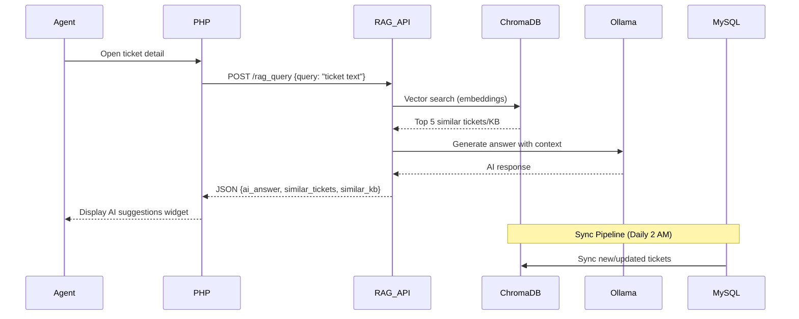

# Design Document

## Overview

Het RAG AI Local Implementation systeem is een volledig on-premise AI oplossing die intelligente suggesties biedt aan agents en gebruikers van het ICT Ticketportaal. Het systeem gebruikt Ollama met Llama 3.1, ChromaDB voor vector storage, en FastAPI voor de query interface, allemaal draaiend op Windows Server zonder externe dependencies.

### Design Principles

1. **Privacy First**: Alle data blijft binnen het K&K netwerk
2. **Zero External Costs**: Geen API subscriptions of cloud services
3. **Graceful Degradation**: Ticketportaal blijft werken als AI unavailable is
4. **Modular Architecture**: Componenten zijn onafhankelijk vervangbaar
5. **Performance Conscious**: Minimale impact op bestaande systemen

## Architecture

### High-Level Architecture Diagram

```
┌─────────────────────────────────────────────────────────────────┐
│                    K&K Windows Server                            │
│                                                                   │
│  ┌──────────────────┐         ┌─────────────────┐              │
│  │  IIS + PHP       │         │  MySQL Database │              │
│  │  Ticketportaal   │◄────────┤  (Existing)     │              │
│  └────────┬─────────┘         └─────────────────┘              │
│           │                                                      │
│           │ HTTP POST                                           │
│           ▼                                                      │
│  ┌──────────────────┐                                           │
│  │  FastAPI         │                                           │
│  │  RAG API         │                                           │
│  │  (Port 5005)     │                                           │
│  └────────┬─────────┘                                           │
│           │                                                      │
│           ├──────────────┬──────────────┬──────────────┐       │
│           ▼              ▼              ▼              ▼       │
│  ┌────────────┐  ┌────────────┐  ┌────────────┐  ┌─────────┐ │
│  │  Ollama    │  │  ChromaDB  │  │  Sentence  │  │  Sync   │ │
│  │  Service   │  │  Vector DB │  │  Transform │  │  Pipeline│ │
│  │  (11434)   │  │            │  │  Embeddings│  │         │ │
│  └────────────┘  └────────────┘  └────────────┘  └─────────┘ │
│                                                                  │
└──────────────────────────────────────────────────────────────────┘
```

### Component Interaction Flow




## Advanced RAG Architecture (2025-2026 Best Practices)

### Hybrid Retrieval Strategy

**1. Dense Vector Search (Semantic)**
- sentence-transformers embeddings
- Cosine similarity in ChromaDB
- Best for: conceptual similarity, paraphrasing

**2. Sparse Keyword Search (Lexical)**
- BM25 algorithm (Rank-BM25 library)
- Exact keyword matching
- Best for: technical terms, error codes, product names

**3. Graph Traversal (Relational)**
- Knowledge graph queries
- Entity relationships
- Best for: "show me related tickets", "what CI items are affected"

**Hybrid Scoring**:
```python
final_score = (
    0.5 * vector_similarity +
    0.3 * bm25_score +
    0.2 * graph_centrality
)
```

### Knowledge Graph Schema

**Core Ontology**:
```
Entities:
- Ticket (id, number, title, category, status)
- User (id, name, department, location)
- CI_Item (id, number, type, brand, model)
- KB_Article (id, title, category)
- Category (id, name)
- Solution (id, description, steps)

Relationships:
- Ticket --CREATED_BY--> User
- Ticket --RELATED_TO--> Ticket (similarity, duplicate)
- Ticket --AFFECTS--> CI_Item
- Ticket --RESOLVED_BY--> Solution
- Solution --DOCUMENTED_IN--> KB_Article
- Ticket --BELONGS_TO--> Category
- User --WORKS_IN--> Department
- CI_Item --LOCATED_AT--> Location
```

**Graph Storage**:
```sql
-- Nodes table
CREATE TABLE graph_nodes (
    node_id TEXT PRIMARY KEY,
    node_type TEXT,  -- ticket, user, ci, kb, etc.
    properties JSON,
    created_at TIMESTAMP
);

-- Edges table
CREATE TABLE graph_edges (
    edge_id INTEGER PRIMARY KEY,
    source_id TEXT,
    target_id TEXT,
    edge_type TEXT,  -- created_by, related_to, etc.
    confidence REAL,  -- 0.0 to 1.0
    properties JSON,
    created_at TIMESTAMP,
    FOREIGN KEY (source_id) REFERENCES graph_nodes(node_id),
    FOREIGN KEY (target_id) REFERENCES graph_nodes(node_id)
);

-- Indexes for fast traversal
CREATE INDEX idx_edges_source ON graph_edges(source_id);
CREATE INDEX idx_edges_target ON graph_edges(target_id);
CREATE INDEX idx_edges_type ON graph_edges(edge_type);
```

### Entity and Relationship Extraction

**NER (Named Entity Recognition)**:
```python
import spacy

# Load Dutch NER model
nlp = spacy.load("nl_core_news_lg")

def extract_entities(text):
    """Extract entities from ticket text"""
    doc = nlp(text)
    
    entities = {
        'products': [],  # HP LaserJet, Dell Latitude
        'errors': [],    # Error 0x0000007B
        'locations': [], # Kantoor Hengelo
        'persons': [],   # Jan Jansen
        'orgs': []       # Sales afdeling
    }
    
    for ent in doc.ents:
        if ent.label_ == 'PRODUCT':
            entities['products'].append(ent.text)
        elif ent.label_ == 'LOC':
            entities['locations'].append(ent.text)
        # etc.
    
    return entities
```

**Relationship Extraction**:
```python
def extract_relationships(ticket_data):
    """Build graph edges from ticket data"""
    edges = []
    
    # Ticket -> User
    edges.append({
        'source': f"ticket_{ticket_data['ticket_id']}",
        'target': f"user_{ticket_data['user_id']}",
        'type': 'CREATED_BY',
        'confidence': 1.0
    })
    
    # Ticket -> CI (from dynamic fields or relations)
    for ci in ticket_data.get('related_cis', []):
        edges.append({
            'source': f"ticket_{ticket_data['ticket_id']}",
            'target': f"ci_{ci['ci_id']}",
            'type': 'AFFECTS',
            'confidence': 0.9
        })
    
    # Ticket -> Ticket (similarity)
    similar_tickets = find_similar_tickets(ticket_data)
    for similar in similar_tickets:
        if similar['similarity'] > 0.8:
            edges.append({
                'source': f"ticket_{ticket_data['ticket_id']}",
                'target': f"ticket_{similar['ticket_id']}",
                'type': 'SIMILAR_TO',
                'confidence': similar['similarity']
            })
    
    return edges
```

### Semantic Chunking Strategy

**Chunk by Logical Sections**:
```python
def chunk_ticket_semantically(ticket):
    """Split ticket into semantic chunks"""
    chunks = []
    
    # Chunk 1: Header info
    chunks.append({
        'type': 'header',
        'content': f"Ticket {ticket['ticket_number']}: {ticket['title']}",
        'metadata': {'category': ticket['category'], 'priority': ticket['priority']}
    })
    
    # Chunk 2: Description
    if ticket['description']:
        chunks.append({
            'type': 'description',
            'content': ticket['description'],
            'metadata': {'section': 'problem'}
        })
    
    # Chunk 3: Each comment separately
    for comment in ticket.get('comments', []):
        chunks.append({
            'type': 'comment',
            'content': comment['text'],
            'metadata': {'author': comment['user'], 'timestamp': comment['created_at']}
        })
    
    # Chunk 4: Resolution
    if ticket['resolution']:
        chunks.append({
            'type': 'resolution',
            'content': ticket['resolution'],
            'metadata': {'section': 'solution'}
        })
    
    return chunks
```

### Reranking Strategy

**Multi-factor Reranking**:
```python
def rerank_results(query, results, graph):
    """Rerank results using multiple signals"""
    
    for result in results:
        score = 0.0
        
        # 1. Semantic similarity (from vector search)
        score += 0.4 * result['vector_similarity']
        
        # 2. Keyword match (BM25)
        score += 0.2 * result['bm25_score']
        
        # 3. Graph centrality (how connected is this entity)
        node_id = f"ticket_{result['ticket_id']}"
        centrality = graph.degree(node_id) / graph.number_of_nodes()
        score += 0.15 * centrality
        
        # 4. Recency (newer tickets weighted higher)
        days_old = (datetime.now() - result['updated_at']).days
        recency_score = 1.0 / (1.0 + days_old / 30)  # Decay over 30 days
        score += 0.15 * recency_score
        
        # 5. User feedback (if available)
        if 'feedback_score' in result:
            score += 0.1 * result['feedback_score']
        
        result['final_score'] = score
    
    # Sort by final score
    return sorted(results, key=lambda x: x['final_score'], reverse=True)
```

### Provenance and Citation

**Response with Sources**:
```python
response_format = {
    "ai_answer": "De laptop start niet op door een BIOS probleem...",
    "sources": [
        {
            "type": "ticket",
            "id": "T-2024-156",
            "title": "Dell laptop BIOS reset",
            "relevance": 0.92,
            "excerpt": "BIOS reset uitgevoerd via F2 menu..."
        },
        {
            "type": "kb_article",
            "id": "KB-45",
            "title": "Laptop Opstartproblemen",
            "relevance": 0.87,
            "excerpt": "Stap 1: Check power adapter..."
        }
    ],
    "relationship_chain": [
        "Ticket T-2024-156 --SIMILAR_TO--> Ticket T-2024-089",
        "Ticket T-2024-156 --AFFECTS--> CI-2024-789 (Dell Latitude 5520)",
        "Solution S-123 --DOCUMENTED_IN--> KB-45"
    ],
    "confidence": 0.89,
    "uncertainties": [
        "Exacte BIOS versie niet vermeld in bronnen"
    ]
}
```

## Components and Interfaces

### 1. Ollama Service

**Purpose**: Host en serve Llama 3.1 LLM model lokaal

**Technology**: Ollama for Windows (native binary)

**Configuration**:
- Model: llama3.1:8b (4.7GB)
- Port: 11434
- Host: 0.0.0.0 (internal network only)
- Storage: C:\TicketportaalAI\models\

**API Interface**:
```json
POST http://localhost:11434/api/generate
{
  "model": "llama3.1:8b",
  "prompt": "Context: ...\n\nQuestion: ...\n\nAnswer:",
  "stream": false,
  "options": {
    "temperature": 0.7,
    "num_predict": 200
  }
}

Response:
{
  "response": "Generated answer text...",
  "done": true
}
```

**Windows Service Configuration**:
- Service Name: Ollama
- Startup Type: Automatic
- Recovery: Restart on failure (1 min delay)
- Log Path: C:\TicketportaalAI\logs\ollama.log

### 2. ChromaDB Vector Database + Knowledge Graph

**Purpose**: Hybrid storage voor vector embeddings (semantic search) + knowledge graph (entity relationships)

**Technology Stack**:
- **ChromaDB 0.4.15**: Vector embeddings (dense retrieval)
- **NetworkX** (Python): In-memory knowledge graph
- **SQLite**: Persistent graph storage (nodes, edges, properties)

**Why ChromaDB over Pinecone for 2025-2026**:
- **100% Lokaal**: Pinecone is cloud-only, ChromaDB draait volledig on-premise
- **Zero Cost**: Geen API fees, geen vendor lock-in
- **Privacy**: Data verlaat nooit het netwerk (GDPR compliant)
- **Performance**: Lokale queries zijn sneller dan API calls
- **Best Practice 2025**: Industry shift naar lokale AI (Ollama, ChromaDB, LM Studio)
- **Scalability**: ChromaDB schaalt tot 100K+ documents zonder performance loss
- **Active Development**: ChromaDB is de de-facto standard voor lokale vector databases
- **Hybrid Retrieval**: Combine vector + graph + keyword search

**Storage Location**: 
- Vector DB: C:\TicketportaalAI\chromadb_data\
- Knowledge Graph: C:\TicketportaalAI\knowledge_graph.db

**Collections Schema**:

```python
# Tickets Collection
{
  "name": "tickets",
  "metadata": {
    "description": "K&K Support Tickets"
  },
  "documents": [
    {
      "id": "ticket_123",
      "document": "Ticket: T-2024-001\nTitle: Printer issue\n...",
      "metadata": {
        "ticket_id": "123",
        "ticket_number": "T-2024-001",
        "category": "Hardware",
        "priority": "Medium",
        "status": "Open",
        "updated_at": "2024-10-22 10:30:00"
      },
      "embedding": [0.123, -0.456, ...]  # 768-dim vector
    }
  ]
}

# KB Articles Collection
{
  "name": "knowledge_base",
  "documents": [
    {
      "id": "kb_45",
      "document": "KB Article: Printer Troubleshooting\nContent: ...",
      "metadata": {
        "kb_id": "45",
        "title": "Printer Troubleshooting",
        "tags": "printer,hardware",
        "updated_at": "2024-10-20 14:00:00"
      },
      "embedding": [...]
    }
  ]
}

# CI Items Collection
{
  "name": "configuration_items",
  "documents": [
    {
      "id": "ci_789",
      "document": "CI: CI-2024-789\nType: Laptop\nBrand: Dell\n...",
      "metadata": {
        "ci_id": "789",
        "ci_number": "CI-2024-789",
        "type": "Laptop",
        "name": "Dell Latitude 5520",
        "updated_at": "2024-10-15 09:00:00"
      },
      "embedding": [...]
    }
  ]
}
```

**Query Interface**:
```python
# Vector similarity search
results = collection.query(
    query_embeddings=[query_vector],
    n_results=5,
    where={"category": "Hardware"}  # Optional filter
)

# Returns:
{
  "ids": [["ticket_123", "ticket_456", ...]],
  "distances": [[0.23, 0.45, ...]],  # Lower = more similar
  "metadatas": [[{...}, {...}, ...]],
  "documents": [["text1", "text2", ...]]
}
```

### 3. Sentence Transformers Embedding Model

**Purpose**: Converteer tekst naar vector embeddings voor semantic search

**Model**: sentence-transformers/all-mpnet-base-v2

**Specifications**:
- Embedding Dimension: 768
- Max Sequence Length: 384 tokens
- Model Size: ~420MB
- Performance: ~100 embeddings/minute (CPU)

**Usage**:
```python
from sentence_transformers import SentenceTransformer

model = SentenceTransformer('sentence-transformers/all-mpnet-base-v2')

# Generate embedding
text = "Printer not working, paper jam error"
embedding = model.encode([text])[0]  # Returns 768-dim numpy array

# Batch processing
texts = ["text1", "text2", "text3"]
embeddings = model.encode(texts, show_progress_bar=True)
```

### 4. Sync Pipeline

**Purpose**: Automatisch synchroniseren van MySQL data naar ChromaDB

**Technology**: Python script + Windows Task Scheduler

**Script Location**: C:\TicketportaalAI\scripts\sync_tickets_to_vector_db.py

**Sync Strategy**:

1. **Daily Full Sync** (2:00 AM):
   - Query alle tickets/KB/CI gewijzigd in laatste 24 uur
   - Generate embeddings
   - Upsert naar ChromaDB (update if exists, insert if new)

2. **Hourly Incremental Sync** (Optional):
   - Query alleen laatste uur wijzigingen
   - Snelle update voor near real-time

**Database Queries**:
```sql
-- Get new/updated tickets WITH dynamic fields and comments
SELECT 
    t.ticket_id,
    t.ticket_number,
    t.title,
    t.description,
    t.category,
    t.priority,
    t.status,
    t.resolution,
    t.updated_at,
    u.first_name,
    u.last_name,
    -- Get dynamic field values as JSON
    (SELECT JSON_ARRAYAGG(
        JSON_OBJECT(
            'field_name', cf.field_name,
            'field_value', tfv.field_value
        )
    )
    FROM ticket_field_values tfv
    JOIN category_fields cf ON tfv.field_id = cf.field_id
    WHERE tfv.ticket_id = t.ticket_id
    ) as dynamic_fields,
    -- Get comments
    (SELECT JSON_ARRAYAGG(
        JSON_OBJECT(
            'comment_text', c.comment_text,
            'created_at', c.created_at,
            'user_name', CONCAT(cu.first_name, ' ', cu.last_name)
        )
    )
    FROM ticket_comments c
    JOIN users cu ON c.user_id = cu.user_id
    WHERE c.ticket_id = t.ticket_id
    ORDER BY c.created_at
    ) as comments,
    -- Get related CI items
    (SELECT JSON_ARRAYAGG(
        JSON_OBJECT(
            'ci_number', ci.ci_number,
            'ci_name', ci.name,
            'ci_type', ci.type
        )
    )
    FROM ticket_ci_relations tcr
    JOIN configuration_items ci ON tcr.ci_id = ci.ci_id
    WHERE tcr.ticket_id = t.ticket_id
    ) as related_cis
FROM tickets t
LEFT JOIN users u ON t.user_id = u.user_id
WHERE t.updated_at >= DATE_SUB(NOW(), INTERVAL 24 HOUR)
   OR t.created_at >= DATE_SUB(NOW(), INTERVAL 24 HOUR);

-- Get published KB articles
SELECT 
    kb_id,
    title,
    content,
    tags,
    category_id,
    updated_at
FROM knowledge_base
WHERE is_published = 1;

-- Get active CI items
SELECT 
    ci_id,
    ci_number,
    type,
    name,
    brand,
    model,
    category,
    notes,
    updated_at
FROM configuration_items
WHERE status != 'Afgeschreven';
```

**Error Handling**:
- Database connection failures: Retry 3 times with exponential backoff
- Embedding generation errors: Log error, skip document, continue
- ChromaDB write failures: Rollback batch, alert admin

**Logging**:
```
[2024-10-22 02:00:15] Starting full sync...
[2024-10-22 02:00:16] Fetched 47 new/updated tickets
[2024-10-22 02:00:45] Generated embeddings for 47 tickets
[2024-10-22 02:00:52] Upserted 47 tickets to ChromaDB
[2024-10-22 02:00:53] Fetched 12 KB articles
[2024-10-22 02:01:10] Synced 12 KB articles
[2024-10-22 02:01:11] Fetched 5 CI items
[2024-10-22 02:01:20] Synced 5 CI items
[2024-10-22 02:01:21] Sync completed successfully!
```

### 5. FastAPI RAG API

**Purpose**: REST API voor RAG queries vanuit PHP

**Technology**: FastAPI 0.104.1 + Uvicorn

**Port**: 5005

**Endpoints**:

#### POST /rag_query
```python
Request:
{
  "query": "Printer geeft paper jam error",
  "top_k": 5,
  "include_tickets": true,
  "include_kb": true,
  "include_ci": false
}

Response:
{
  "ai_answer": "Een paper jam error bij een printer kan verschillende oorzaken hebben...",
  "similar_tickets": [
    {
      "ticket_number": "T-2024-156",
      "title": "HP printer paper jam",
      "category": "Hardware",
      "distance": 0.23
    },
    ...
  ],
  "similar_kb": [
    {
      "kb_id": "45",
      "title": "Printer Paper Jam Troubleshooting",
      "distance": 0.18
    },
    ...
  ],
  "similar_ci": []
}
```

#### GET /health
```python
Response:
{
  "status": "healthy",
  "ollama": "http://localhost:11434",
  "vector_db": "ChromaDB ready",
  "uptime_seconds": 86400
}
```

#### GET /stats
```python
Response:
{
  "tickets_count": 1247,
  "kb_count": 89,
  "ci_count": 234,
  "last_sync": "2024-10-22 02:01:21",
  "total_queries_today": 156
}
```

**Advanced RAG Processing Flow (2025-2026 Best Practices)**:
```python
1. Receive query text
2. Extract entities and intent (NER)
3. Apply metadata filters (category, date, priority)
4. Hybrid retrieval:
   a. Dense vector search (semantic similarity)
   b. Sparse keyword search (BM25)
   c. Graph traversal (related entities)
5. Rerank results by:
   - Semantic relevance
   - Graph centrality
   - Recency
   - User feedback scores
6. Build structured context with provenance
7. Create RAG prompt with:
   - Query
   - Top passages with sources
   - Graph-derived facts/paths
   - Confidence scores
8. Query Ollama API
9. Post-process response:
   - Add source citations
   - Include relationship chains
   - Flag uncertainties
10. Return response with metadata
```

**RAG Prompt Template**:
```
Je bent een ICT support assistent voor Kruit & Kramer.

Gegeven Context:
Vergelijkbare Tickets:
- T-2024-156: HP printer paper jam (Hardware)
- T-2024-089: Canon printer error (Hardware)

Relevante KB Artikelen:
- Printer Paper Jam Troubleshooting

Gebruikersvraag: Printer geeft paper jam error

Geef een duidelijk, praktisch antwoord gebaseerd op de context. 
Als je het antwoord niet weet, zeg dat eerlijk.

Antwoord:
```

**Performance Optimization**:
- Connection pooling voor Ollama
- Query result caching (LRU cache, 100 items)
- Request timeout: 30 seconds
- Rate limiting: 10 requests/minute per IP

**Windows Service Configuration**:
- Service Name: TicketportaalRAG
- Command: uvicorn rag_api:app --host 0.0.0.0 --port 5005
- Working Directory: C:\TicketportaalAI\scripts
- Startup Type: Automatic
- Log Path: C:\TicketportaalAI\logs\rag_api.log


### 6. PHP AI Helper Integration

**Purpose**: Integratie laag tussen Ticketportaal en RAG API

**File Location**: includes/ai_helper.php

**Class Interface**:
```php
class AIHelper {
    private $rag_api_url = 'http://localhost:5005/rag_query';
    private $enabled = true;  // Feature flag
    private $timeout = 30;
    
    // Check if AI is available
    public function isEnabled(): bool
    
    // Get AI suggestions for ticket text
    public function getSuggestions(
        string $ticket_text,
        bool $include_tickets = true,
        bool $include_kb = true,
        bool $include_ci = false
    ): array
    
    // Get system statistics
    public function getStats(): array
    
    // Private: Check RAG API health
    private function checkHealth(): bool
}
```

**Usage Example**:
```php
// In agent/ticket_detail.php
require_once '../includes/ai_helper.php';

$ai = new AIHelper();

if ($ai->isEnabled()) {
    $ticket_text = $ticket['title'] . ' ' . $ticket['description'];
    $result = $ai->getSuggestions($ticket_text);
    
    if ($result['success']) {
        $ai_data = $result['data'];
        // Display AI widget
        include '../includes/ai_suggestion_widget.php';
    }
}
```

**Error Handling**:
- Connection timeout: Return graceful error, don't break page
- API unavailable: Log error, return success=false
- Invalid response: Log warning, return empty suggestions

**Feature Flag Control**:
```php
// config/config.php
define('AI_ENABLED', true);  // Master switch

// Per-user rollout (optional)
define('AI_BETA_USERS', [5, 12, 23]);  // User IDs

// In ai_helper.php
public function isEnabled() {
    if (!AI_ENABLED) return false;
    
    // Beta rollout check
    if (defined('AI_BETA_USERS')) {
        return in_array($_SESSION['user_id'], AI_BETA_USERS);
    }
    
    return $this->checkHealth();
}
```

## Data Quality Requirements for AI Training

### Critical: Complete Category Field Implementation

**Voor optimale AI performance is het essentieel dat**:

1. **Alle categories hebben dynamic fields geconfigureerd**
   - Hardware: Merk, Model, Serienummer, Locatie
   - Software: Applicatie naam, Versie, Licentie type
   - Netwerk: Switch/Router, Poort nummer, VLAN
   - Account: Username, Email, Afdeling, Toegangsniveau
   - etc.

2. **Agents vullen dynamic fields consistent in**
   - Training/documentatie voor agents
   - Verplichte velden waar relevant
   - Dropdown opties voorgedefinieerd (geen vrije tekst waar mogelijk)

3. **Comments bevatten rijke informatie**
   - Stappen die genomen zijn
   - Resultaten van troubleshooting
   - Afbeeldingen met context (screenshots, foto's)

4. **CI relaties zijn correct**
   - Tickets gekoppeld aan relevante CI items
   - CI items hebben complete specificaties

### Data Enrichment Strategy

**Phase 1: Populate Existing Categories** (Pre-AI deployment)
- Review alle bestaande categories
- Configureer dynamic fields voor elke category
- Seed test data met realistische voorbeelden
- Train agents op correct gebruik

**Phase 2: Historical Data Enrichment** (Optional)
- Backfill dynamic fields voor belangrijke oude tickets
- Extract structured data uit descriptions (semi-automated)
- Prioriteer tickets met veel views/references

**Phase 3: Continuous Quality** (Post-AI deployment)
- Monitor field completion rates
- AI dashboard toont data quality metrics
- Agents krijgen feedback op incomplete tickets

### Image Processing (Future Enhancement)

**OCR voor Screenshots**:
- Extract tekst uit error screenshots
- Include in ticket embeddings
- Tools: Tesseract OCR, Azure Computer Vision (lokaal), EasyOCR

**Image Descriptions**:
- Manual: Agents voegen beschrijving toe bij upload
- Automated: Local vision model (LLaVA, CLIP) genereert beschrijving
- Include in embeddings: "[Afbeelding: Windows blue screen met error 0x0000007B]"

## Data Models

### Ticket Embedding Document

**BELANGRIJK**: Voor optimale AI performance moeten alle category dynamic fields volledig ingevuld zijn. Het model leert van:
- Gestructureerde category field data (dropdowns, text fields, etc.)
- Ticket beschrijvingen en resoluties
- Comments (inclusief tekst uit afbeeldingen via OCR indien mogelijk)
- Relaties tussen tickets en CI items

```python
{
  "id": "ticket_123",
  "document": """
    Ticket: T-2024-001
    Title: Laptop start niet op
    Category: Hardware
    Priority: High
    Description: Laptop geeft geen beeld meer na Windows update. 
                 Power LED brandt wel maar scherm blijft zwart.
    
    Dynamic Fields:
    - Merk: Dell
    - Model: Latitude 5520
    - Serienummer: ABC123XYZ
    - Locatie: Kantoor Hengelo
    - Afdeling: Sales
    
    Comments:
    - Agent: "Laptop opgehaald, BIOS reset uitgevoerd"
    - Agent: "Scherm werkt weer, Windows update opnieuw geïnstalleerd"
    - [Afbeelding beschrijving: Foto van BIOS scherm met reset optie]
    
    Resolution: BIOS reset uitgevoerd, laptop start nu normaal.
    User: Jan Jansen
    Related CI: CI-2024-789 (Dell Latitude 5520)
  """,
  "metadata": {
    "ticket_id": "123",
    "ticket_number": "T-2024-001",
    "category": "Hardware",
    "priority": "High",
    "status": "Closed",
    "updated_at": "2024-10-22 10:30:00",
    "has_dynamic_fields": true,
    "has_comments": true,
    "has_images": true,
    "related_ci_count": 1
  },
  "embedding": [0.123, -0.456, 0.789, ...]  # 768 dimensions
}
```

### KB Article Embedding Document

```python
{
  "id": "kb_45",
  "document": """
    KB Article: Laptop Opstartproblemen
    Tags: laptop, hardware, troubleshooting
    Content: 
    Als een laptop niet opstart, volg deze stappen:
    1. Check of power adapter correct aangesloten is
    2. Probeer hard reset (power knop 30 sec ingedrukt)
    3. Verwijder externe apparaten
    4. Test met externe monitor
    5. BIOS reset indien nodig
  """,
  "metadata": {
    "kb_id": "45",
    "title": "Laptop Opstartproblemen",
    "tags": "laptop,hardware,troubleshooting",
    "updated_at": "2024-10-20 14:00:00"
  },
  "embedding": [...]
}
```

### CI Item Embedding Document

```python
{
  "id": "ci_789",
  "document": """
    CI: CI-2024-789
    Type: Laptop
    Name: Dell Latitude 5520
    Brand: Dell
    Model: Latitude 5520
    Category: Werkplek Hardware
    Notes: Standaard configuratie voor kantoormedewerkers.
           Intel i5, 16GB RAM, 256GB SSD.
  """,
  "metadata": {
    "ci_id": "789",
    "ci_number": "CI-2024-789",
    "type": "Laptop",
    "name": "Dell Latitude 5520",
    "updated_at": "2024-10-15 09:00:00"
  },
  "embedding": [...]
}
```

## Error Handling

### Error Categories and Responses

#### 1. Ollama Service Unavailable
```python
# Detection
try:
    response = requests.post(OLLAMA_API, json=payload, timeout=5)
except requests.exceptions.ConnectionError:
    # Ollama down

# Response
{
  "error": "AI service temporarily unavailable",
  "fallback": "Please try again later or contact support",
  "error_code": "OLLAMA_UNAVAILABLE"
}
```

#### 2. ChromaDB Query Failure
```python
# Detection
try:
    results = collection.query(...)
except Exception as e:
    # ChromaDB error

# Response
{
  "error": "Search service error",
  "fallback": "Unable to find similar tickets",
  "error_code": "VECTOR_DB_ERROR"
}
```

#### 3. Embedding Generation Failure
```python
# Detection
try:
    embedding = model.encode([text])[0]
except Exception as e:
    # Model error

# Response
{
  "error": "Query processing error",
  "fallback": "Unable to process query",
  "error_code": "EMBEDDING_ERROR"
}
```

#### 4. System Overload
```python
# Detection
cpu = psutil.cpu_percent(interval=1)
ram = psutil.virtual_memory().percent

if cpu > 80 or ram > 85:
    # System under load

# Response
{
  "error": "System under heavy load",
  "fallback": "Please try again in a few minutes",
  "error_code": "SYSTEM_OVERLOAD"
}
```

#### 5. Database Connection Failure
```python
# Detection
try:
    conn = mysql.connector.connect(...)
except mysql.connector.Error as e:
    # MySQL down

# Response
- Log error to sync log
- Send email alert to admin
- Retry after 5 minutes (max 3 retries)
- If all retries fail, skip sync cycle
```

### Error Logging Strategy

**Log Levels**:
- ERROR: Critical failures requiring immediate attention
- WARNING: Non-critical issues that should be investigated
- INFO: Normal operations and successful completions
- DEBUG: Detailed information for troubleshooting

**Log Format**:
```
[2024-10-22 14:35:12] [ERROR] [RAG_API] Ollama connection timeout after 30s
[2024-10-22 14:35:12] [ERROR] [RAG_API] Query failed for user_id=23, query="printer issue"
[2024-10-22 14:35:13] [WARNING] [SYNC] Skipped ticket_id=456 due to empty description
[2024-10-22 14:35:45] [INFO] [SYNC] Successfully synced 47 tickets in 32 seconds
```

**Log Rotation**:
- Daily log files: rag_api_YYYY-MM-DD.log
- Sync logs: sync_YYYY-MM-DD.log
- Keep logs for 30 days
- Archive older logs to compressed format

### Alerting Rules

**Email Alerts**:
1. Service down for >5 minutes
2. Sync failed 3 consecutive times
3. Disk space <20GB
4. Error rate >10% in last hour
5. CPU sustained >90% for >10 minutes

**Alert Email Template**:
```
Subject: [ALERT] Ticketportaal AI - {SERVICE} Issue

Service: {service_name}
Status: {status}
Time: {timestamp}
Error: {error_message}

Action Required:
{recommended_action}

Logs:
{last_10_log_lines}

---
Automated alert from Ticketportaal AI Monitoring
```

## Testing Strategy

### Unit Testing

**Python Components**:
```python
# tests/test_sync_pipeline.py
def test_get_new_tickets():
    """Test MySQL query for new tickets"""
    tickets = get_new_tickets(since_hours=24)
    assert len(tickets) > 0
    assert 'ticket_id' in tickets[0]

def test_embedding_generation():
    """Test sentence-transformers model"""
    text = "Test ticket description"
    embedding = model.encode([text])[0]
    assert embedding.shape == (768,)

def test_chromadb_upsert():
    """Test ChromaDB write operations"""
    collection.upsert(
        ids=["test_1"],
        documents=["test doc"],
        embeddings=[[0.1] * 768]
    )
    results = collection.get(ids=["test_1"])
    assert len(results['ids']) == 1
```

**PHP Components**:
```php
// tests/AIHelperTest.php
class AIHelperTest extends PHPUnit\Framework\TestCase {
    public function testIsEnabled() {
        $ai = new AIHelper();
        $this->assertIsBool($ai->isEnabled());
    }
    
    public function testGetSuggestionsFormat() {
        $ai = new AIHelper();
        $result = $ai->getSuggestions("test query");
        $this->assertArrayHasKey('success', $result);
        $this->assertArrayHasKey('data', $result);
    }
}
```

### Integration Testing

**End-to-End RAG Query Test**:
```python
def test_full_rag_pipeline():
    """Test complete RAG flow"""
    # 1. Sync test data
    sync_tickets_to_vector_db()
    
    # 2. Query RAG API
    response = requests.post(
        'http://localhost:5005/rag_query',
        json={'query': 'printer problem'}
    )
    
    # 3. Verify response
    assert response.status_code == 200
    data = response.json()
    assert 'ai_answer' in data
    assert len(data['similar_tickets']) > 0
```

**PHP Integration Test**:
```php
// Test AI widget rendering
$ai = new AIHelper();
$result = $ai->getSuggestions("Test ticket text");

if ($result['success']) {
    ob_start();
    include 'includes/ai_suggestion_widget.php';
    $html = ob_get_clean();
    
    assert(strpos($html, 'AI Suggesties') !== false);
}
```

### Load Testing

**Concurrent Query Test**:
```python
import concurrent.futures

def load_test_rag(num_concurrent=10, num_queries=100):
    """Test RAG API under load"""
    
    def single_query():
        return requests.post(
            'http://localhost:5005/rag_query',
            json={'query': 'test query'},
            timeout=30
        )
    
    with concurrent.futures.ThreadPoolExecutor(max_workers=num_concurrent) as executor:
        futures = [executor.submit(single_query) for _ in range(num_queries)]
        results = [f.result() for f in concurrent.futures.as_completed(futures)]
    
    success_rate = sum(1 for r in results if r.status_code == 200) / len(results)
    avg_time = sum(r.elapsed.total_seconds() for r in results) / len(results)
    
    print(f"Success rate: {success_rate*100:.1f}%")
    print(f"Avg response time: {avg_time:.2f}s")
```

**Sync Performance Test**:
```python
def test_sync_performance():
    """Measure sync time for different dataset sizes"""
    
    test_sizes = [100, 500, 1000]
    
    for size in test_sizes:
        start = time.time()
        sync_tickets_to_vector_db(limit=size)
        duration = time.time() - start
        
        print(f"{size} tickets synced in {duration:.1f}s")
        assert duration < size * 0.5  # Max 0.5s per ticket
```

### VM Testing Procedure

**Phase 1: Baseline Measurement**
1. Deploy ticketportaal zonder AI
2. Measure CPU, RAM, response times
3. Document baseline metrics

**Phase 2: AI Installation**
1. Install Ollama + Llama 3.1
2. Install Python dependencies
3. Measure resource increase

**Phase 3: Load Testing**
1. Sync 1000 tickets
2. Run 100 concurrent queries
3. Simulate 10 active users
4. Measure performance impact

**Phase 4: Analysis**
1. Generate performance report
2. Compare baseline vs AI-enabled
3. Create deployment recommendation

**Success Criteria**:
- CPU increase <30% average
- RAM increase <10GB
- Query response time <5s (95th percentile)
- No UI performance degradation
- Sync completes in <15 minutes

## Deployment Architecture

### Directory Structure

```
C:\TicketportaalAI\
├── venv\                          # Python virtual environment
├── scripts\
│   ├── sync_tickets_to_vector_db.py
│   ├── rag_api.py
│   ├── config.py
│   ├── health_monitor.ps1
│   └── start_rag_api.bat
├── chromadb_data\                 # Vector database storage
│   ├── chroma.sqlite3
│   └── [collection data]
├── models\                        # Ollama model storage
│   └── llama3.1-8b\
├── logs\
│   ├── rag_api_YYYY-MM-DD.log
│   ├── sync_YYYY-MM-DD.log
│   ├── ollama.log
│   └── errors.log
└── backups\                       # Optional backup location

C:\inetpub\wwwroot\ticketportaal\
├── includes\
│   ├── ai_helper.php             # NEW
│   └── ai_suggestion_widget.php  # NEW
├── admin\
│   └── ai_dashboard.php          # NEW
└── [existing files]
```

### Windows Services Configuration

**Service 1: Ollama**
- Binary: C:\Users\[USER]\AppData\Local\Programs\Ollama\ollama.exe
- Arguments: serve
- Startup: Automatic
- Recovery: Restart after 1 minute

**Service 2: TicketportaalRAG**
- Binary: C:\TicketportaalAI\venv\Scripts\python.exe
- Arguments: -m uvicorn rag_api:app --host 0.0.0.0 --port 5005
- Working Dir: C:\TicketportaalAI\scripts
- Startup: Automatic
- Recovery: Restart after 1 minute

### Windows Task Scheduler Jobs

**Job 1: Daily Sync**
- Name: TicketportaalAISync
- Trigger: Daily at 02:00
- Action: C:\TicketportaalAI\venv\Scripts\python.exe
- Arguments: C:\TicketportaalAI\scripts\sync_tickets_to_vector_db.py
- Run as: SYSTEM

**Job 2: Health Monitor**
- Name: TicketportaalAIHealthMonitor
- Trigger: Every 30 minutes
- Action: powershell.exe
- Arguments: -File C:\TicketportaalAI\scripts\health_monitor.ps1
- Run as: SYSTEM

**Job 3: Hourly Incremental Sync (Optional)**
- Name: TicketportaalAISyncHourly
- Trigger: Every hour
- Action: C:\TicketportaalAI\venv\Scripts\python.exe
- Arguments: C:\TicketportaalAI\scripts\sync_tickets_to_vector_db.py --incremental
- Run as: SYSTEM

### Network Configuration

**Firewall Rules**:
- Allow inbound TCP 5005 (RAG API) from internal network only
- Allow inbound TCP 11434 (Ollama) from localhost only
- Block external access to both ports

**Port Usage**:
- 5005: FastAPI RAG API (internal network)
- 11434: Ollama API (localhost only)
- 3306: MySQL (existing, localhost)
- 80/443: IIS Ticketportaal (existing, public)


## Security Design

### Authentication and Authorization

**RAG API Security**:
- No authentication required (internal network only)
- IP whitelist: 192.168.x.x (K&K internal network)
- Rate limiting: 10 requests/minute per IP
- Request size limit: 10KB max

**PHP Integration Security**:
- Reuse existing session authentication
- Only authenticated users can trigger AI queries
- Admin-only access to AI dashboard
- Feature flag for staged rollout

### Data Privacy

**Vector Embeddings**:
- Embeddings are mathematical representations, not reversible to original text
- No PII stored in metadata (only IDs and categories)
- Embeddings stored locally, never transmitted externally

**Query Logging**:
- Log query metadata only (user_id, timestamp, success/fail)
- Do NOT log full query text (may contain sensitive info)
- Logs rotated and deleted after 30 days

**Access Control**:
```php
// Only authenticated users
if (!isset($_SESSION['user_id'])) {
    die('Unauthorized');
}

// Admin-only for dashboard
if ($_SESSION['role'] !== 'admin') {
    die('Access denied');
}
```

### Backup and Recovery

**Backup Strategy**:
1. **ChromaDB Data**: Daily backup to network share
2. **Configuration Files**: Version controlled in Git
3. **Logs**: Archived monthly to compressed format
4. **Models**: No backup needed (can re-download)

**Backup Script**:
```powershell
# backup_ai_data.ps1
$date = Get-Date -Format "yyyyMMdd"
$source = "C:\TicketportaalAI\chromadb_data"
$dest = "\\nas\backups\ticketportaal_ai\chromadb_$date.zip"

Compress-Archive -Path $source -DestinationPath $dest
```

**Recovery Procedure**:
1. Stop services (Ollama, TicketportaalRAG)
2. Restore ChromaDB data from backup
3. Restart services
4. Verify health endpoints
5. Test query functionality

## Performance Optimization

### Caching Strategy

**Query Result Caching**:
```python
from functools import lru_cache
import hashlib

@lru_cache(maxsize=100)
def cached_vector_search(query_hash, collection_name):
    """Cache vector search results"""
    # Reduces repeated embeddings + searches
    pass
```

**Embedding Caching**:
- Cache frequently used embeddings in memory
- LRU eviction policy
- Max cache size: 1000 embeddings (~6MB RAM)

### Resource Throttling

**CPU Throttling**:
```python
import psutil

def should_accept_query():
    cpu = psutil.cpu_percent(interval=1)
    if cpu > 80:
        return False, "System under heavy load"
    return True, "OK"
```

**Concurrent Request Limiting**:
```python
from fastapi import HTTPException
import asyncio

# Semaphore for max concurrent requests
query_semaphore = asyncio.Semaphore(5)

@app.post("/rag_query")
async def rag_query(request: QueryRequest):
    async with query_semaphore:
        # Process query
        pass
```

### Database Query Optimization

**Sync Pipeline Optimization**:
```sql
-- Use indexes for faster queries
CREATE INDEX idx_tickets_updated ON tickets(updated_at);
CREATE INDEX idx_kb_published ON knowledge_base(is_published, updated_at);
CREATE INDEX idx_ci_status ON configuration_items(status, updated_at);

-- Batch processing
SELECT * FROM tickets 
WHERE updated_at >= ? 
LIMIT 100 OFFSET ?;
```

**ChromaDB Optimization**:
- Use batch upserts (100 documents at a time)
- Enable HNSW index for faster similarity search
- Periodic vacuum/optimize operations

## Monitoring and Observability

### Metrics Collection

**System Metrics**:
- CPU usage (overall and per-service)
- RAM usage (overall and per-service)
- Disk I/O (read/write rates)
- Network I/O (API requests/responses)

**Application Metrics**:
- RAG query count (per hour/day)
- Average query response time
- Success rate (%)
- Error rate by type
- Sync duration and success rate

**Business Metrics**:
- Tickets with AI suggestions viewed
- AI suggestions clicked/used
- Agent feedback on AI quality
- Time-to-resolution comparison (with/without AI)

### Monitoring Dashboard

**Admin Dashboard (admin/ai_dashboard.php)**:
```
┌─────────────────────────────────────────────────┐
│  AI Module Dashboard                            │
├─────────────────────────────────────────────────┤
│  System Status                                  │
│  ✅ Ollama Service: Running                     │
│  ✅ RAG API: Running                            │
│  ✅ Last Sync: 2024-10-22 02:01:21 (Success)   │
├─────────────────────────────────────────────────┤
│  Statistics                                     │
│  📊 Tickets Embedded: 1,247                    │
│  📚 KB Articles: 89                             │
│  🖥️  CI Items: 234                              │
│  🔍 Queries Today: 156                          │
├─────────────────────────────────────────────────┤
│  Performance                                    │
│  ⚡ Avg Response Time: 3.2s                     │
│  ✅ Success Rate: 98.5%                         │
│  💾 Disk Usage: 15.2 GB / 60 GB                │
│  🧠 RAM Usage: 7.8 GB / 16 GB                  │
├─────────────────────────────────────────────────┤
│  Actions                                        │
│  [Sync Now] [View Logs] [Restart Services]     │
└─────────────────────────────────────────────────┘
```

### RAG Quality Metrics

**Answer Faithfulness**:
- Measure: Does answer match source documents?
- Method: Semantic similarity between answer and sources
- Target: >90% faithfulness score

**Retrieval Precision**:
- Measure: Are retrieved documents relevant?
- Method: Human feedback + click-through rate
- Target: >85% precision

**Graph Coverage**:
- Measure: % of entities in knowledge graph
- Method: Count unique entities vs total tickets
- Target: >70% coverage

**Extraction Quality**:
- Measure: Accuracy of NER and relationship extraction
- Method: Human-in-the-loop validation (sample 100 tickets/month)
- Target: >80% accuracy

**Latency**:
- Measure: End-to-end query response time
- Method: P50, P95, P99 percentiles
- Target: P95 < 5 seconds

**Edge Confidence**:
- Measure: Reliability of graph relationships
- Method: Confidence scores on edges
- Action: Filter edges with confidence < 0.5

### Continuous Improvement Loop

**Weekly**:
1. Review low-confidence answers
2. Identify missing entities/relationships
3. Update ontology if needed
4. Retrain NER on new examples

**Monthly**:
1. Analyze user feedback patterns
2. Identify common failure modes
3. Expand knowledge graph coverage
4. Optimize chunking strategy

**Quarterly**:
1. Full RAG pipeline audit
2. A/B test reranking weights
3. Evaluate new embedding models
4. Consider graph database upgrade (Neo4j, etc.)

### Alerting System

**Alert Channels**:
1. Email (primary)
2. Log file (always)
3. Windows Event Log (critical only)

**Alert Severity Levels**:
- CRITICAL: Service down, immediate action required
- WARNING: Performance degradation, investigate soon
- INFO: Normal operations, FYI only

**RAG-Specific Alerts**:
- Faithfulness score drops below 85%
- Graph extraction errors >10% of tickets
- Retrieval latency P95 >7 seconds
- Edge confidence average <0.6

**Alert Rules**:
```powershell
# health_monitor.ps1
$alerts = @()

# Check services
$ollama = Get-Service Ollama
if ($ollama.Status -ne 'Running') {
    $alerts += @{
        Severity = 'CRITICAL'
        Message = 'Ollama service is not running'
        Action = 'Restart service immediately'
    }
}

# Check disk space
$disk = Get-PSDrive C
$freeGB = [math]::Round($disk.Free/1GB, 2)
if ($freeGB -lt 20) {
    $alerts += @{
        Severity = 'WARNING'
        Message = "Low disk space: ${freeGB}GB free"
        Action = 'Clean up old logs or expand disk'
    }
}

# Send alerts
foreach ($alert in $alerts) {
    Send-MailMessage -To "ict@kruit-en-kramer.nl" `
        -Subject "[${alert.Severity}] Ticketportaal AI Alert" `
        -Body $alert.Message
}
```

## Common Pitfalls and Mitigation

### 1. Over-Graphing Too Early

**Pitfall**: Modeling every possible relationship creates noise and complexity

**Mitigation**:
- Start with core relationships only: CREATED_BY, AFFECTS, SIMILAR_TO, RESOLVED_BY
- Add new edge types only when they improve query results
- Monitor graph query performance - prune unused edge types

### 2. Noisy Entity Extraction

**Pitfall**: Poor NER creates bad graph edges (worse than no edges)

**Solution**:
- Invest in high-quality NER model (spaCy nl_core_news_lg + custom training)
- Human-in-the-loop validation for first 500 tickets
- Confidence thresholds: only add edges with confidence >0.7
- Regular audits: sample 50 tickets/month for extraction quality

### 3. Latency Spikes

**Pitfall**: Graph traversal + vector search + reranking = slow queries

**Optimization**:
- Cache common subgraphs (e.g., "all tickets in Hardware category")
- Precompute graph communities (Louvain algorithm)
- Limit traversal depth to 2 hops maximum
- Parallel execution: vector search + graph query simultaneously
- Index hot paths in graph database

### 4. Opaque Answers

**Pitfall**: Users don't trust AI without understanding reasoning

**Solution**:
- Always return provenance (source tickets, KB articles)
- Show relationship chain: "T-2024-156 → similar to → T-2024-089 → resolved by → KB-45"
- Visual graph representation (optional): Mermaid diagram of entity relationships
- Confidence scores: "High confidence (92%)" vs "Low confidence (54%) - verify manually"
- Highlight uncertainties: "Note: Exact BIOS version not found in sources"

### 5. Stale Graph Data

**Pitfall**: Graph becomes outdated as tickets are updated

**Solution**:
- Incremental graph updates during hourly sync
- Tombstone deleted tickets (soft delete in graph)
- Recompute similarity edges weekly for active tickets
- Version graph snapshots for rollback capability

### 6. Category Field Inconsistency

**Pitfall**: Agents fill fields differently, breaking structured queries

**Solution**:
- Enforce dropdown options (no free text where possible)
- Validation rules: "Serienummer must match pattern ABC123XYZ"
- Auto-suggest based on previous tickets
- Data quality dashboard: show completion rates per agent
- Quarterly data cleanup sprints

## Scalability Considerations

### Current Capacity

**Expected Load (Year 1)**:
- 2,000 tickets embedded
- 100 KB articles
- 500 CI items
- 50 queries/day

**System Capacity**:
- ChromaDB: Up to 100,000 documents
- Ollama: 10-20 concurrent queries
- Disk: 60GB (40GB free after initial data)

### Future Scaling Options

**Vertical Scaling** (Upgrade existing server):
- Add RAM: 16GB → 32GB (2x capacity)
- Add CPU cores: 8 → 16 (2x throughput)
- Add SSD: 60GB → 120GB (2x storage)

**Horizontal Scaling** (Add dedicated AI server):
- Move Ollama + RAG API to separate server
- Keep ChromaDB on main server or shared storage
- Load balance queries across multiple Ollama instances

**Model Optimization**:
- Switch to smaller model (Llama 3.2 3B) for faster responses
- Or upgrade to larger model (Llama 3.1 70B) for better accuracy
- Quantized models for reduced RAM usage

### Future Integrations

**Phase 2: Product Catalog**:
- Add products_collection to ChromaDB
- Sync product data from inventory system
- Enable product recommendations in tickets

**Phase 3: Ecoro Integration**:
- Add ecoro_orders_collection
- Add ecoro_prices_collection
- Enable pricing/availability queries

**Phase 4: SHD Integration**:
- Unified search across Ticketportaal + SHD
- Cross-system ticket linking
- Shared knowledge base

## Rollback and Disaster Recovery

### Rollback Procedure

**Instant Disable (Feature Flag)**:
```php
// config/config.php
define('AI_ENABLED', false);  // Takes effect immediately
```

**Stop Services**:
```powershell
Stop-Service Ollama
Stop-Service TicketportaalRAG
Disable-ScheduledTask -TaskName "TicketportaalAISync"
```

**Remove UI Integration**:
```php
// Comment out in ticket views
// if ($ai->isEnabled()) { ... }
```

**Full Rollback**:
1. Stop all AI services
2. Restore database from pre-deployment backup
3. Restore application files from backup
4. Restart IIS
5. Verify ticketportaal works without AI

### Disaster Recovery

**Scenario 1: ChromaDB Corruption**:
1. Stop RAG API service
2. Delete C:\TicketportaalAI\chromadb_data\
3. Restore from latest backup
4. If no backup: Run full sync to rebuild
5. Restart RAG API service

**Scenario 2: Ollama Model Corruption**:
1. Stop Ollama service
2. Delete model: ollama rm llama3.1:8b
3. Re-download: ollama pull llama3.1:8b
4. Restart Ollama service

**Scenario 3: Complete System Failure**:
1. Rebuild VM/server from scratch
2. Restore application files from Git
3. Restore ChromaDB from backup
4. Re-download Ollama model
5. Reconfigure services
6. Run health checks

**Recovery Time Objectives**:
- Feature flag disable: <1 minute
- Service restart: <5 minutes
- ChromaDB restore: <30 minutes
- Full system rebuild: <4 hours

## Documentation Requirements

### Admin Documentation

**Installation Guide**:
- Prerequisites checklist
- Step-by-step installation
- Configuration options
- Verification procedures

**Operations Manual**:
- Daily operations checklist
- Monitoring procedures
- Backup procedures
- Troubleshooting guide

**Maintenance Schedule**:
- Daily: Check service status
- Weekly: Review logs and metrics
- Monthly: Archive old logs
- Quarterly: Performance review

### User Documentation

**Agent Guide**:
- How to use AI suggestions
- Interpreting AI responses
- When to trust AI vs manual research
- Providing feedback on AI quality

**End User Guide**:
- AI-powered self-service (future)
- Understanding AI recommendations
- Privacy and data usage

### Developer Documentation

**API Documentation**:
- RAG API endpoints
- Request/response formats
- Error codes
- Rate limits

**Integration Guide**:
- Using AIHelper class
- Adding AI to new pages
- Customizing prompts
- Extending functionality

**Code Documentation**:
- Inline code comments
- Function docstrings
- Architecture diagrams
- Data flow diagrams

## Conclusion

Dit design document beschrijft een complete, production-ready architectuur voor een lokale RAG AI module. Het systeem is ontworpen met focus op privacy, performance, en maintainability, en biedt een solide basis voor toekomstige uitbreidingen.

**Key Design Decisions**:
1. 100% lokaal - geen externe dependencies
2. Modular architecture - componenten zijn vervangbaar
3. Graceful degradation - ticketportaal blijft werken zonder AI
4. Comprehensive monitoring - proactieve problem detection
5. Staged rollout - minimale risk bij deployment

**Next Steps**: Proceed to implementation planning (tasks.md)
